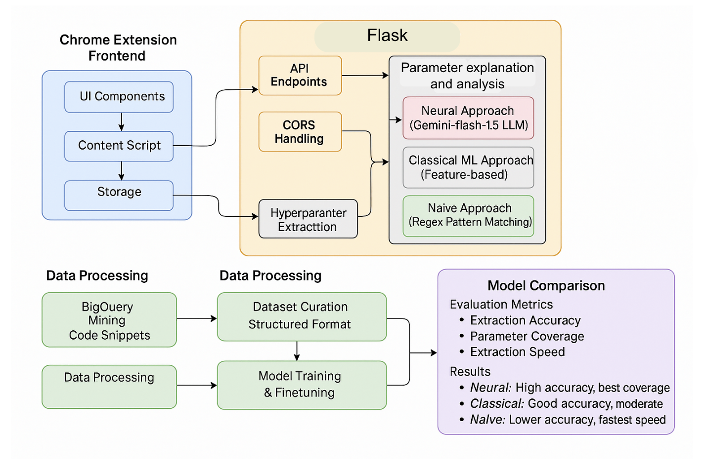
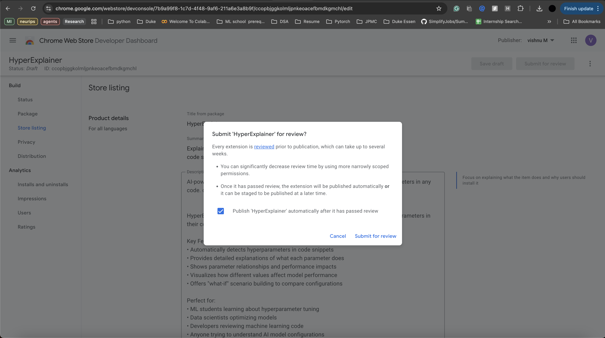
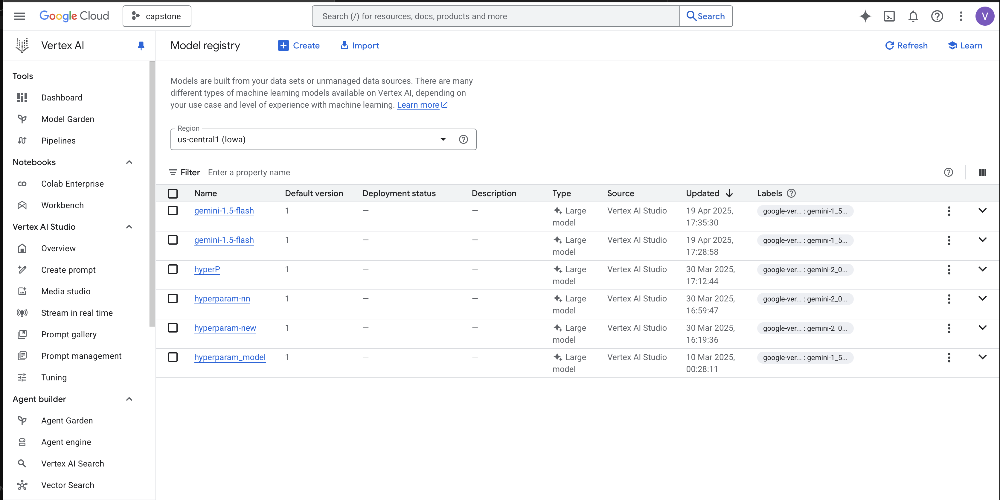
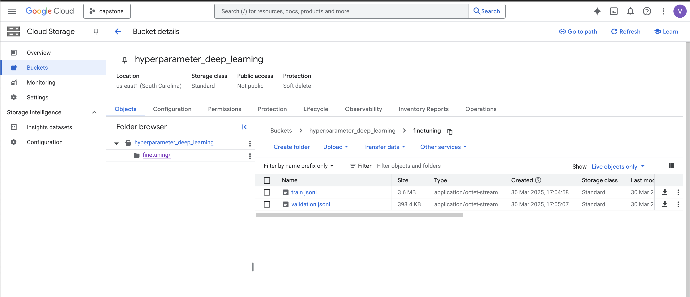

# HyperExplainer: AI-Powered Hyperparameter Analysis Tool

**HyperExplainer** is a Chrome extension with Python backend for explaining machine learning hyperparameters:

- **Select** code on any webpage including ChatGPT
- **Extract** hyperparameters using Google's Gemini 1.5 Flash LLM
- **Visualize** parameter impacts with interactive charts
- **Compare** different parameter configurations
- **Understand** hyperparameter correlations and best practices

## Architecture

### Backend (Python)
- Flask API server with endpoints for:
  - `/extract` - Parse code to detect hyperparameters
  - `/explain` - Get detailed explanations for specific parameters
  - `/predict_performance` - Generate performance predictions
  - `/parameter_correlations` - Calculate correlation matrix

### Extension (React/TypeScript)
- Chrome extension with:
  - Popup for initial parameter detection
  - Detail view for parameter exploration
  - Content script for code selection on any website

## High-Level Visualization

The following diagram shows the high-level architecture and data flow of the HyperExplainer system:



## Repository Structure

```
hyperparam_modified/
├── assets/                     # Screenshots and images
│   ├── popup.png
│   ├── popup-on-chatgpt.png
│   ├── explainer.png
│   └── ... (other images)
├── hyperexplainer/
│   ├── backend/                # Python Flask server
│   │   ├── app.py              # Main Flask application
│   │   ├── hyperparams.py      # Core hyperparameter extraction logic
│   │   ├── get_api_key.py      # Helper script for API setup
│   │   ├── Dockerfile          # Container configuration
│   │   ├── requirements.txt    # Python dependencies
│   │   └── scripts/            # Utility scripts
│   │       ├── test_hyperparams.py
│   │       ├── test_env.py
│   │       └── setup_gc_credentials.py
│   ├── extension/              # Chrome extension
│   │   ├── src/                # Frontend source code
│   │   │   ├── popup/          # Extension popup interface
│   │   │   │   ├── Popup.tsx   # Main popup component
│   │   │   │   └── popup.css
│   │   │   ├── detail/         # Detailed parameter view
│   │   │   │   ├── Detail.tsx  # Parameter detail component
│   │   │   │   └── detail.css
│   │   │   ├── utils/          # Utility functions
│   │   │   │   └── paramParser.ts
│   │   │   ├── contentScript.ts # Content script for web page integration
│   │   ├── popup.html      # Popup HTML template
│   │   └── detail.html     # Detail view HTML template
│   │   ├── public/             # Static assets
│   │   │   └── manifest.json   # Extension manifest
│   │   ├── vite.config.ts      # Build configuration
│   │   ├── package.json        # Node dependencies
│   │   └── tsconfig.json       # TypeScript configuration
│   ├── .env                    # Environment variables
│   ├── .env.example            # Example environment file
│   ├── docker-compose.yml      # Docker compose setup
│   └── README.md               # Project documentation
└── hyperexplainer.zip          # Pre-built extension package
```

## Key Features

- **Parameter Detection**: Extract explicit and implicit hyperparameters from code using multiple methods:
  - Neural (Gemini LLM-based, ~90% accuracy): High accuracy, comprehensive detection
  - Classical (feature-based extraction, ~75% accuracy): Balanced approach
  - Naive (regex-based, ~50% accuracy): Fastest method, simpler detection

- **Parameter Explanation**: Get comprehensive analysis for each hyperparameter including:
  - Importance
  - Technical definition
  - Impact analysis
  - Alternative values
  - Best practices
  - Trade-offs

- **Performance Prediction**: Visualize how different parameter values affect:
  - Training accuracy
  - Validation accuracy
  - Model performance

- **Parameter Correlation**: Understand relationships between different hyperparameters

- **Scenario Comparison**: Save and compare different hyperparameter configurations

## Data Storage

- Server is stateless - no persistent backend database
- Extension uses Chrome's local storage to save:
  - Extracted parameters
  - User-created scenarios
- Privacy-focused: Code snippets processed but not permanently stored


## Quick Start with Pre-built Version (If you can't find my extension in the google extensions market, probably because they've not approved it yet)

The backend has been deployed at: https://hyperexplainer-backend-695116221974.us-central1.run.app

To use the pre-built extension:

1. Download the `hyperparam_modified/hyperexplainer.zip` file from the repo
2. Unzip the file to a folder
3. Open Chrome and go to `chrome://extensions/`
4. Enable "Developer Mode" (toggle in top-right)
5. Click "Load unpacked" and select the unzipped folder
6. Navigate to your extensions bar and click on the HyperExplainer icon
7. Go to ChatGPT and open a new chat
8. Generate a sample code snippet or paste code
9. Click on the extension - it should detect the code automatically


### Video Walkthrough of the whole process :

[](https://youtu.be/xmQhxcoyIkg)

## To Start from Scratch (not necessary, but if you want to build it yourself)

1. **Clone this repo**  
2. **Create environment file**:
   Copy `.env.example` to `.env` and add required API keys:
   ```
   # Required
   GEMINI_API_KEY=<your_gemini_api_key>
   
   # Optional (for advanced Google Cloud features)
   GOOGLE_PROJECT_ID=<your_gcp_project_id>
   GOOGLE_SERVICE_ACCOUNT_KEY=<your_service_account_json>
   
   # Server configuration
   BACKEND_PORT=5000
   ```

3. **Set up the backend**:
   ```bash
   cd backend
   pip install -r requirements.txt
   python app.py
   ```
   
   Or with Docker:
   ```bash
   cd backend
   docker build -t hyperexplainer-backend .
   docker run -e GEMINI_API_KEY -p 5000:5000 hyperexplainer-backend
   ```

4. **Build the extension**:
   ```bash
   cd extension
   npm install
   npm run build
   ```

5. **Load the extension**:
   - Open Chrome and navigate to `chrome://extensions/`
   - Enable "Developer mode"
   - Click "Load unpacked" and select the `extension/dist` directory

## Usage

1. Visit any website with machine learning code (e.g., ChatGPT, GitHub, Jupyter)
2. Select code containing hyperparameters
3. Click the HyperExplainer icon in your browser
4. View detected parameters in the popup
5. Click "Analyze" for detailed explanations and visualizations
6. Adjust parameters with interactive sliders to see predicted impacts
7. Save different configurations as scenarios for comparison

## API Reference

| Endpoint | Method | Description | Example Body |
|----------|--------|-------------|-------------|
| `/extract` | POST | Extract hyperparameters | `{"code": "learning_rate=0.01", "method": "neural"}` |
| `/explain` | POST | Get detailed explanation | `{"name": "learning_rate", "value": "0.01"}` |
| `/predict_performance` | POST | Predict impact of parameter values | `{"name": "dropout_rate", "value": "0.2"}` |
| `/parameter_correlations` | POST | Generate correlation matrix | `{"parameters": {"learning_rate": "0.01", "batch_size": "32"}}` |

## Technologies

- **Backend**: Flask, Python, Google Gemini 1.5 Flash LLM
- **Frontend**: React, TypeScript, Chrome Extension API, Vite
- **Visualization**: Chart.js
- **Deployment**: Docker

## Fine-tuned LLM Models

The neural extraction approach uses a fine-tuned version of Google's Gemini 1.5 Flash model. The project leverages several models visible in Google Vertex AI:

- gemini-1.5-flash (most recent versions)
- hyperP
- hyperparam-nn
- hyperparam-new
- hyperparam_model

For more detailed information about these models, you can access the presentation at: https://www.canva.com/design/DAGlHl5xxmw/NV82VnZRhhw3WV3VxtwjWA/edit

## Development

- Use `get_api_key.py` script to easily obtain a Gemini API key
- Run `test_env.py` to verify environment configuration
- Extension uses Vite for modern bundling and HMR

### Backend Development
- Core logic in `backend/app.py` and `backend/hyperparams.py`
- Parameter extraction logic in `extract_hyperparameters()` function
- Explanation generation in `explain_hyperparameter()` function

### Frontend Development
- UI implemented in React/TypeScript
- Key components in `extension/src/popup/Popup.tsx` and `extension/src/detail/Detail.tsx`
- Build configuration in `extension/vite.config.ts`

## Troubleshooting

If you encounter issues:

### API Key Problems
- Run `python backend/test_env.py` to verify your API key configuration
- Use `python backend/get_api_key.py` to set up your Gemini API key

### Extension Not Loading
- Check Chrome console for errors
- Ensure the backend is running if using local setup
- Verify the backend URL in the extension configuration

### No Parameters Detected
- Try different extraction methods (Neural, Classical, Naive)
- Ensure the code snippet contains valid hyperparameters
- Check backend logs for processing errors

## Project Explanation on YouTube

[](https://youtu.be/OIu3fjdiCAY?si=2P5QCFSAt0WBuaMe)

Watch my detailed video walkthrough demonstrating the HyperExplainer in action.

## Screenshots

### Extension Popup Interface

The popup interface allows quick parameter detection and analysis:


### Parameter Explainer View

The detailed parameter explanation view provides in-depth analysis:


### Alternative Values Analysis

Visual comparison of alternative parameter values:


### Verification

Project submission verification:



### Model Training and Dataset

The project uses fine-tuned models trained on curated datasets:


*Custom model deployed in Google Vertex AI platform*


*Dataset curated for training the hyperparameter extraction model*

## Ethics Statement

I take privacy and ethical considerations seriously. For complete details about data usage, privacy practices, and ethical guidelines, please refer to the [HyperExplainer Privacy Policy](https://docs.google.com/document/d/1Jfo2UKFxNhmxEZDnB4C2qLJyW2J9GYTB869ht-yAGtI/edit?tab=t.0#heading=h.qj52gzu8ztmg).


## References

### Hyperparameter Visualization and Tuning
- [TensorFlow Hyperparameter Tuning with TensorBoard](https://www.tensorflow.org/tensorboard/hyperparameter_tuning_with_hparams) - Official guide for visualizing hyperparameters in TensorFlow
- [Keras Tuner Visualization Guide](https://keras.io/keras_tuner/guides/visualize_tuning/) - How to visualize hyperparameter tuning in Keras
- [Research Paper: Hyperparameter Optimization in Machine Learning](https://aisecure-workshop.github.io/aml-iclr2021/papers/18.pdf) - Academic research on hyperparameter optimization techniques
- [Optuna Visualization Tutorial](https://optuna.readthedocs.io/en/stable/tutorial/10_key_features/005_visualization.html) - Official documentation for visualizing hyperparameters in Optuna
- [Visualizing Hyperparameters in Optuna](https://medium.com/optuna/visualizing-hyperparameters-in-optuna-86c224bd255f) - Medium article on advanced hyperparameter visualization

### Development Tools
- [Cursor](https://cursor.sh/) - Used for code annotations and frontend troubleshooting

